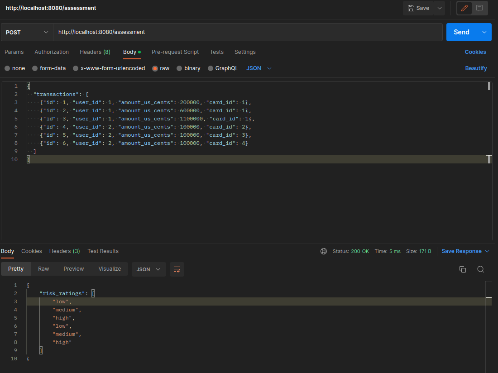

# Transaction Assessment basic implementation in golang for Sardine.ai
PS: Minimum viable solution to the test given the low time (solution based on the TS implementation at [TS Risk Assessment Solution](https://github.com/NicolasFkm/transaction-assessment))

## How to run

To run it locally you can run the command `go run ./cmd/transaction-assessment-go/`

## Rules

Transaction's risk is determined by applying following rules. If multiple rules match the condition, highest risk wins.

## Evidences

## Risk rules

| id  | condition                              | risk   |
| --- | -------------------------------------- | ------ |
| 1   | transaction amount is more than $5000  | medium |
| 2   | transaction amount is more than $10000 | high   |
| 3   | user spend more than $10000 in total   | medium |
| 4   | user spend more than $20000 in total   | high   |
| 5   | user uses more than 1 cards            | medium |
| 6   | user users more than 2 cards           | high   |
